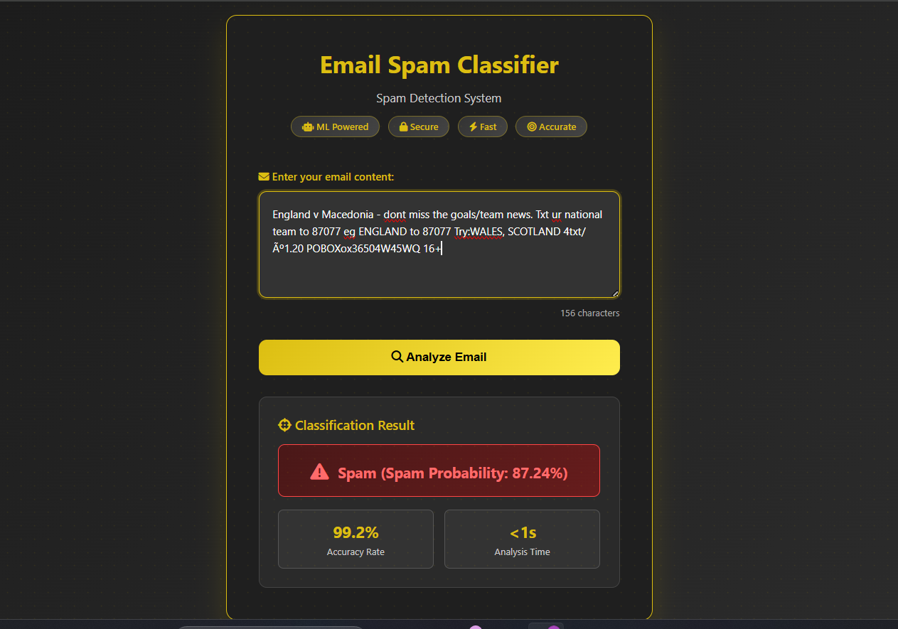

# 📧 Email Spam Classifier

A simple machine learning web app to classify emails as **Spam** or **Not Spam** using Flask. 


## 🚀 Features

- Classifies raw email text as "Spam" or "Not Spam"
- Trained ML model using NLP techniques
- Interactive and responsive web UI


---

## 🧠 Tech Stack

- Python
- Flask
- Scikit-learn
- HTML/CSS (Web UI)


---

## 🖥️ Run Locally

### 1. Clone the Repository

```bash
git clone https://github.com/Vrunda2/Email_Spam_Classifier.git
cd Email_Spam_Classifier
```

### 2. Install Requirements

```bash
pip install -r requirements.txt
```

### 3. Run the App Locally

```bash
python app.py
```

Visit: [http://127.0.0.1:5000](http://127.0.0.1:5000)


## 📂 Project Structure

```
Email_Spam_Classifier/
├── app.py
├── model.pkl
├── vectorizer.pkl
├── templates/
│   └── index.html
├── static/
│   └── style.css
├── requirements.txt
└── README.md
```

---

## 📸 UI Preview



---


